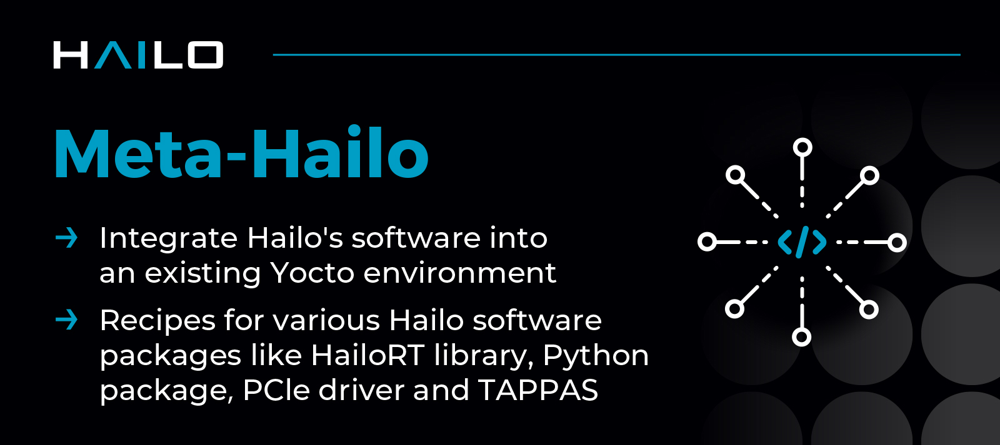

  

# Meta-Hailo #

Hailo’s Yocto layers allow the user to integrate Hailo’s software into an existing Yocto environment. They include recipes
for:
- [**PCIe driver**](https://github.com/hailo-ai/hailort-drivers)
- Hailo-8 firmware
- HailoRT GStreamer library implementing the HailoNet element
- [**HailoRT library**](https://github.com/hailo-ai/hailort)
- pyHailoRT - HailoRT Python API (wraps the run-time library)
- Hailo [**TAPPAS**](https://github.com/hailo-ai/tappas) - framework for optimized execution of video-processing pipelines

## Usage

See [**hailo.ai developer zone documentation**](https://hailo.ai/developer-zone/documentation/hailort/latest/) (registration is required for  full documentation access).

## Changelog

See [**hailo.ai developer zone - HailoRT changelog**](https://hailo.ai/developer-zone/documentation/hailort/latest/?sp_referrer=changelog/changelog.html) (registration required).

## Contact

Contact information and support is available at [**hailo.ai**](https://hailo.ai/contact-us/).

## About Hailo

Hailo offers breakthrough AI Inference Accelerators and AI Vision Processors uniquely designed to accelerate embedded deep learning applications on edge devices.

The Hailo AI Inference Accelerators allow edge devices to run deep learning applications at full scale more efficiently, effectively, and sustainably, with an architecture that takes advantage of the core properties of neural networks.

The Hailo AI Vision Processors (SoC) combine Hailo's patented and field proven AI inferencing capabilities with advanced computer vision engines, generating premium image quality and advanced video analytics.

For more information, please visit [**hailo.ai**](https://hailo.ai/).
